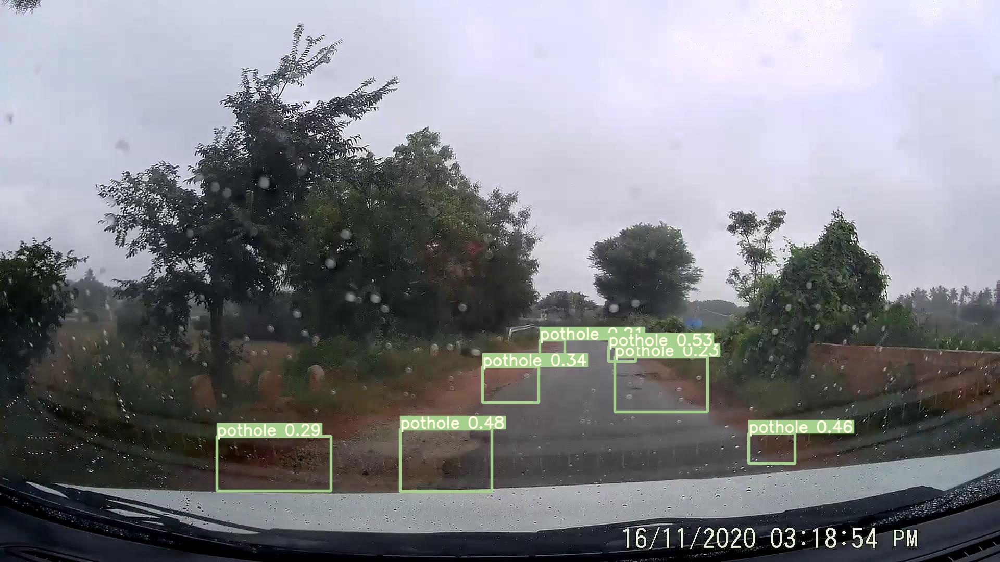
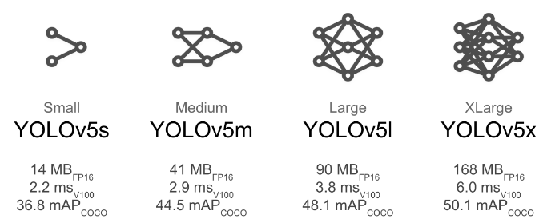
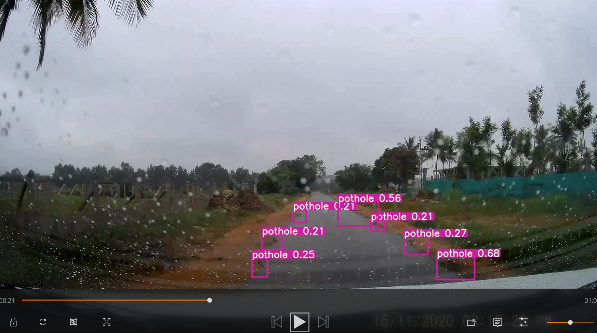

# Pothole detector on indianRoads

### An approach of machine learning techique to detect potholes using a very famous RPN based detection api YOLOV5.

 


**history:**

graduate student at the University of Washington’s programming languages and software engineering lab, he proposed the YOLO model in a CVPR 2016 paper that won the OpenCV People’s Choice Award.
Joseph Redmon, creator of the popular object detection algorithm YOLO

```
he introduces YOLO v1,
YOLO v2(YOLO9000),
YOLOv3,
YOLOv3-tiny.
```

Despite enjoying his work, days later Redmon tweeted, he had stopped his CV research because he found that the related ethical issues “became impossible to ignore.”

**YOLOv4**

As Redmond was not currently working on the CV for a long time, a new team of three developers released YOLOv4. It was released by Alexey Bochoknovskiy, Chien-Yao Wang, and Hong-Yuan Mark Liao. Alexey is the one who developed the Windows version of YOLO back in the days.

Some of the new features of YOLOv4 is:

    Anyone with a 1080 Ti or 2080 ti GPU can run the YOLOv4 model easily. 
    YOLOv4 includes CBN(Cross-iteration batch normalization) and PAN(Pan aggregation network) methods.
    Weighted-Residual-Connections(WRC).
    Cross-Stage-Partial connections(CSP), a new backbone to enhance CNN(convolution neural network)
    Self-adversarial-training(SAT): A new data augmentation technique
    DropBlock regularization

**YOLOv5**

After a few days of the release of the YOLOv4 model on 27 May 2020, YOLOv5 got released by Glenn Jocher(Founder & CEO of Utralytics). It was publicly released on Github here. Glenn introduced the YOLOv5 Pytorch based approach, and Yes! YOLOv5 is written in the Pytorch framework.


**dataprep:**

can be manually prepared over [lebelme](https://github.com/wkentaro/labelme)  annotation tool


YOLO: In YOLO labeling format, a .txt file with the same name is created for each image file in the same directory. Each .txt file contains the annotations for the corresponding image file, that is object class, object coordinates, height and width.

<object-class> <x> <y> <width> <height>

```
eg:
0 45 55 29 67
1 99 83 28 44
```


### YOLOV5 Pretrained Checkpoints has 4 different variant
 

i used a smaller one YOLOv5s // 14mb size


images used  for train : 417 for train and 64 for validset..on colab with gpu

### u can downlaod the video for inference from [here](https://drive.google.com/file/d/17v0iaoOq-lt_e6gVQdSTqd9NdpodHzJh/view?usp=sharing)


**output:**

[](https://youtu.be/6P9bpwoqhMg)
